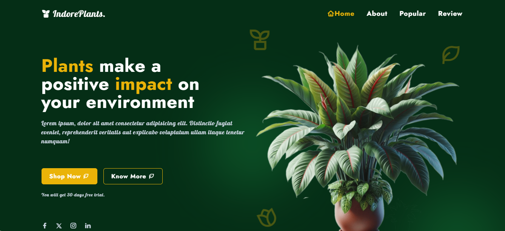
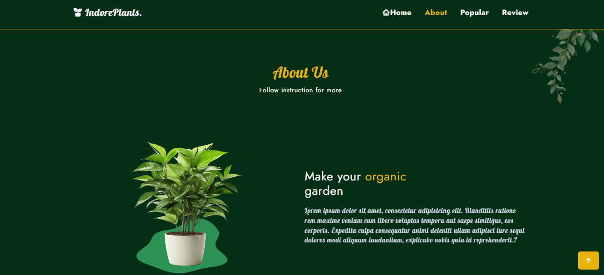
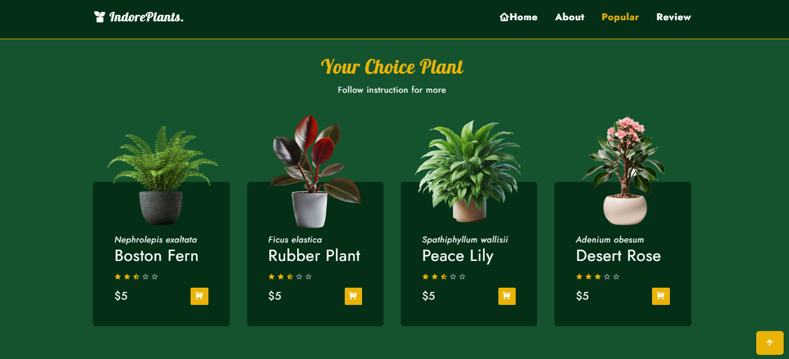
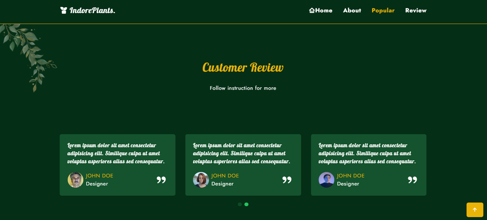

# Plants Website

A plant website could feature detailed information on various plant species, including care guides, growth habits, and ideal conditions. It might offer a plant identification tool, a blog with gardening tips, an online store for seeds and tools, and a community forum for plant enthusiasts. The design would likely be lush and green, with vibrant images and user-friendly navigation to make learning about and purchasing plants easy and enjoyable.

# Demo Preview

**You can see the live demo project please [Click Here](https://pkdemoproject3.netlify.app/)**






# Features

- **Gardening Blog:** Regularly updated articles on topics like gardening tips, seasonal advice, and plant care.
- **Fluid Grid Layout:** Uses a flexible grid that resizes and repositions elements dynamically to fit the screen size, from desktops to mobile devices.
- **Responsive Navigation Menu:** A navigation menu that adapts to different screen sizes, often transforming into a collapsible or “hamburger” menu on smaller screens.
- **Mobile-First Design:** Designed with mobile users in mind first, ensuring that essential features and content are easily accessible on smaller screens.

# Technologies Used

### Frontend

- **HTML5/TailwindCSS v3.4.10 :** Structure and styling of the website.
- **JavaScript :** Interactive features and dynamic content.
- **Responsive Design :** Customizing Screens, Flexbox, and Grid for mobile-friendly design
- **ScrollReveal :** This is a JavaScript library that allows you to easily create and manage scroll-based animations on a website.
- **Remix Icon :** This is a set of open-source, high-quality icons designed for web development.
- **Swiper CSS v11.1.10 :** Swiper is a modern, flexible, and highly customizable touch slider that you can use for implementing sliders, carousels, and other interactive content on your website.

### Backend

- **Node.js :** JavaScript runtime for server-side development.

### Version Control

- **Git :** Distributed version control system.

### Hosting and Deployment

- **Netlify/Vercel :** Hosting platforms for static websites and JAMstack applications.

# Installation

### Prerequisites

- **Code Editor :** You can use any code editor like Visual Studio Code, Sublime Text, or others to write your code.
- **Node.js :** Tailwind CSS requires Node.js to run. You can download it from the official Node.js website.
- **npm (Node Package Manager) :** npm comes bundled with Node.js. You'll use npm to install Tailwind CSS and other dependencies.

### Steps

If you run this project locally, then follow these steps below :

1.  **Open Terminal (Command Prompt, PowerShell, etc.) :**

    - Navigate to the directory where you want to clone the project.
    - Run the following command to clone the repository:

      ```sh
      https://github.com/pranto113015/Plants-Website-Using-tailwindCss.git
      ```

2.  **Navigate into the project directory :**

    - Replace `Plants-Website-Using-tailwindCss` with the actual folder name of the project.

      ```sh
      cd Plants-Website-Using-tailwindCss
      ```

3.  **Run Tailwind CSS in Watch Mode :**

    - To start watching for changes, run:

      ```sh
      npm run watch
      ```

4.  **Click the run option of the menu bar and again click the start debugging or open with live server**

Or you can do this way

1. Download the project
2. Unzip the file
3. Open with your IDE such as vs code and follow the command :

   ```sh
   npm run watch
   ```

4. Now open with live server
